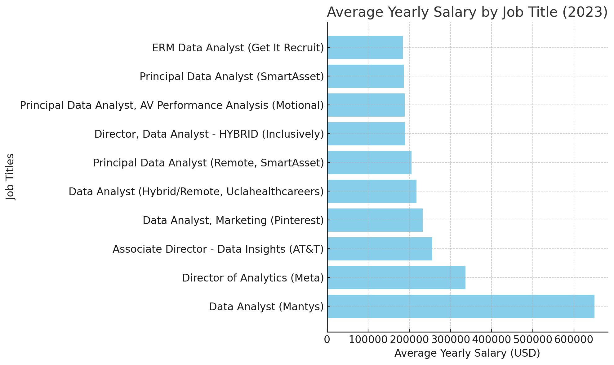

# Introduction
Welcome to my SQL Portfolio Project, where I delve into the data job market with a focus on data analyst roles. This project is a personal exploration into identifying the top-paying jobs, in-demand skills, and the intersection of high demand with high salary in the field of data analytics.

Check out my SQL queries here: [project_sql folder](/project_sql/).
# Background
The motivation behind this project stemmed from my desire to understand the data analyst job market better. I aimed to discover which skills are paid the most and in demand, making my job search more targeted and effective. 

The data for this analysis is from Luke Barousse’s [Course](https://www.lukebarousse.com/courses). This data includes details on job titles, salaries, locations, and required skills. 

### The questions I wanted to answer through my SQL queries were:

1. What are the top-paying data analyst jobs?
2. What skills are required for these top-paying jobs?
3. What skills are most in demand for data analysts?
4. Which skills are associated with higher salaries?
5. What are the most optimal skills to learn for a data analyst looking to maximize job market value?
# Tools I Used
In this project, I utilized a variety of tools to conduct my analysis:

- **SQLiteViz (https://sqliteviz.com):** SQLiteViz was used as a visual SQL editor and lightweight SQLite database interface for query testing and analysis.(To get familiar with the data)
- **SQL** (Structured Query Language): Enabled me to interact with the database, extract insights, and answer my key questions through queries.
- **PostgreSQL**: As the database management system, PostgreSQL allowed me to store, query, and manipulate the job posting data.
- **Visual Studio Code:** This open-source administration and development platform helped me manage the database and execute SQL queries.
- **Git & GitHub:** Essential for version control and sharing
my SQL scripts and analysis, ensuring collaboration and project tracking.
# The Analysis
Each query in this project was focused on exploring particular aspects of the data analyst job market. Here's how I went about answering each question:

### 1. Top Paying Data Analyst Jobs

To identify the highest-paying roles, I filtered data analyst positions by average yearly salary and location, focusing on remote jobs. This query highlights the high paying opportunities in the field.

```sql
SELECT
    job_id,
    job_title,
    job_location,
    job_schedule_type,
    salary_year_avg,
    job_posted_date,
    name AS company_name
FROM 
    job_postings_fact
LEFT JOIN company_dim ON company_dim.company_id = job_postings_fact.company_id
WHERE
    job_title_short = 'Data Analyst'
    AND job_location = 'Anywhere'
    AND salary_year_avg IS NOT NULL

ORDER BY
    salary_year_avg DESC
LIMIT 10;
```
### Key Insights

1. **Highest Salary:**
   The **Data Analyst** position at **Mantys** offers the highest salary at **$650,000** annually, indicating a premium role in the field.

2. **Top Management Salaries:**
   Senior roles like **Director of Analytics** at **Meta** offer competitive salaries, with an average of **$336,500**, while the **Associate Director** at **AT&T** offers **$255,829.5**.

3. **Competitive Salaries for Analysts:**
   Roles such as **Data Analyst, Marketing** at **Pinterest** and **Principal Data Analyst** at **SmartAsset** offer salaries ranging from **$186,000** to **$232,423**.

4. **Remote & Hybrid Options:**
   Many positions, like those at **Uclahealthcareers** and **SmartAsset**, offer flexible or remote work, aligning with current workforce trends.

6. **Salary Range:**
   Salaries for data roles range from **$186,000** to **$650,000**, showcasing diverse opportunities from entry-level to senior management.


*Bargraph visualizing the salary for the top 10 salaries for data analysts; ChatGPT generated this graph from my SQL query*


### 2. Skills for Top Paying Jobs

To understand what skills are required for the top-paying jobs, I joined the job postings with the skills data, providing insights into what employers value for high-compensation roles.

```sql
-- Gets the top 10 paying Data Analyst jobs
WITH top_paying_jobs AS (
    SELECT
        job_id,
        job_title,
        salary_year_avg
    FROM
        job_postings_fact
    WHERE
        job_title_short = 'Data Analyst'
        AND salary_year_avg IS NOT NULL
        AND job_location = 'Anywhere'
    ORDER BY
        salary_year_avg DESC
    LIMIT 10
)
SELECT
    top_paying_jobs.job_id,
    top_paying_jobs.job_title,
    top_paying_jobs.salary_year_avg,
    skills_dim.skills
FROM
    top_paying_jobs
    INNER JOIN
    skills_job_dim ON top_paying_jobs.job_id = skills_job_dim.job_id
    INNER JOIN
    skills_dim ON skills_job_dim.skill_id = skills_dim.skill_id
ORDER BY
    top_paying_jobs.salary_year_avg DESC;
```
### Most Demanded Skills for Data Analysts in 2023

Based on job postings, the following skills are highly sought after for data analyst roles:

- **SQL** is the most in-demand skill, with a total count of **8** job postings.
- **Python** follows closely with **7** job postings.
- **Tableau** is also highly demanded, with **6** job postings.
- Other skills like **R**, **Snowflake**, **Pandas**, and **Excel** show varying degrees of demand.

### 3. In-Demand Skills for Data Analysts

This query helped identify the skills most frequently requested in job postings, directing focus to areas with high demand.

```sql
SELECT
  skills_dim.skills,
  COUNT(skills_job_dim.job_id) AS demand_count
FROM
  job_postings_fact
  INNER JOIN
    skills_job_dim ON job_postings_fact.job_id = skills_job_dim.job_id
  INNER JOIN
    skills_dim ON skills_job_dim.skill_id = skills_dim.skill_id
WHERE
  job_postings_fact.job_title_short = 'Data Analyst'
GROUP BY
  skills_dim.skills
ORDER BY
  demand_count DESC
LIMIT 5;
```
### Key Takeaways:
- **SQL** is by far the most sought-after skill for data analysts, emphasizing its foundational role in data management and querying.
- **Excel** remains crucial, indicating its ongoing importance in data manipulation and analysis.
- **Python** continues to be highly valued for its versatility in data analysis, scripting, and machine learning.
- **Tableau** and **Power BI** are essential for data visualization, with Tableau leading slightly in demand, but both are highly sought after in data-driven environments.
- If you're aiming to stand out as a data analyst, mastering **SQL** and **Excel** should be a top priority, followed closely by proficiency in **Python** and **Tableau**.

### 4. Skills Based on Salary

Exploring the average salaries associated with different skills revealed which skills are the highest paying.

```sql
SELECT
  skills_dim.skills AS skill,
  ROUND(AVG(job_postings_fact.salary_year_avg),2) AS avg_salary
FROM
  job_postings_fact
INNER JOIN
  skills_job_dim ON job_postings_fact.job_id = skills_job_dim.job_id
INNER JOIN
  skills_dim ON skills_job_dim.skill_id = skills_dim.skill_id
WHERE
  job_postings_fact.job_title_short = 'Data Analyst'
  AND job_postings_fact.salary_year_avg IS NOT NULL
GROUP BY
  skills_dim.skills
ORDER BY
  avg_salary DESC;
```
### Key Trends in Top-Paying Data Analyst Skills

Based on top-paying data analyst skills, here are the key trends:

1. **Big Data & Cloud Skills Dominate**:
   - High-paying skills like **PySpark** ($208K), **Databricks** ($141K), and **GCP** ($122K) show a growing demand for cloud-based data processing and big data frameworks.
   - Companies are prioritizing professionals with expertise in distributed computing and cloud services.

2. **Version Control & DevOps Influence Salaries**:
   - Tools like **Bitbucket** ($189K), **GitLab** ($154K), and **Jenkins** ($125K) suggest that version control and CI/CD pipelines are becoming essential for data analysts.
   - Knowledge of **DevOps** and automation is increasingly valuable in driving higher salaries.

3. **AI & Machine Learning Skills Stand Out**:
   - Tools like **Watson** ($160K), **DataRobot** ($155K), **Scikit-Learn** ($125K), and **Airflow** ($126K) highlight strong demand for machine learning and MLOps.
   - Companies are willing to pay more for analysts who can build, deploy, and automate AI models.

4. **Programming Languages & Data Science Libraries Matter**:
   - **Swift** ($153K), **Golang** ($145K), and **Scala** ($124K) show that expertise beyond **Python** and **R** is valuable.
   - Libraries like **Pandas** ($151K), **NumPy** ($143K), and **Scikit-Learn** ($125K) emphasize the importance of strong data manipulation and machine learning skills.

5. **Search & Data Storage Technologies Are Lucrative**:
   - **Elasticsearch** ($145K), **Couchbase** ($160K), and **PostgreSQL** ($123K) demonstrate the value of expertise in database management and search engines.
   - Companies working with large datasets seek professionals skilled in indexing, querying, and optimization.

### 5. Most Optimal Skills to Learn

Combining insights from demand and salary data, this query aimed to pinpoint skills that are both in high demand and have high salaries, offering a strategic focus for skill development.

```sql
SELECT
    skills_dim.skill_id, skills_dim.skills,
    COUNT (skills_job_dim.job_id) AS demand_count,
    ROUND (AVG(job_postings_fact.salary_year_avg), 0) AS avg_salary
FROM 
    job_postings_fact
INNER JOIN skills_job_dim ON job_postings_fact.job_id = skills_job_dim.job_id
INNER JOIN skills_dim ON skills_job_dim.skill_id = skills_dim.skill_id
WHERE
    job_title_short = 'Data Analyst'
    AND salary_year_avg IS NOT NULL
    AND job_work_from_home = True
GROUP BY
    skills_dim.skill_id
HAVING
    COUNT(skills_job_dim.job_id)>10
ORDER BY
    avg_salary DESC, 
    demand_count DESC
LIMIT 25;
```

# Most Demanded Skills for Data Analysts in 2023

The following skills are highly sought after, along with their demand and average salary:

- **Python**: With **236** job postings, Python is the most in-demand skill, offering an average salary of **$101,397**.
- **Tableau**: **230** job postings and an average salary of **$99,288**, showing strong demand for visualization skills.
- **R**: In **148** job postings, R offers an average salary of **$100,499**, emphasizing its significance in data analysis.
- **Go**: **27** job postings and an average salary of **$115,320**, offering a strong salary compared to other skills.
- **Snowflake**: With **37** job postings, Snowflake's average salary is **$112,948**, showing its increasing relevance in cloud-based data management.
- **Azure**: In **34** job postings, Azure skills command an average salary of **$111,225**.
- **SQL Server** (**35** postings, **$97,786**) and **AWS** (**32** postings, **$108,317**) are also critical in many data analyst roles.
- **Hadoop** (**22** postings, **$113,193**) and **BigQuery** (**13** postings, **$109,654**) are specialized but highly valued for big data-related positions.
- **Jira** and **Confluence** are essential for project management, with **Jira** posting **20** jobs at **$104,918** and **Confluence** posting **11** jobs at **$114,210**.

### Salary Comparison:
- **Go** offers the highest average salary at **$115,320**, followed by **Snowflake** (**$112,948**) and **Azure** (**$111,225**).
- **Python** and **R** show competitive salaries, though slightly lower than specialized skills like **Go** and **Snowflake**.


Each query not only served to answer a specific question but also to improve my understanding of SQL and database analysis. Through this project, I learned to leverage SQL's powerful data manipulation capabilities to derive meaningful insights from complex datasets.

# What I Learned

Throughout this project, I enhanced several key SQL techniques and skills:

- **Complex Query Construction**: I learned how to build advanced SQL queries that combine multiple tables and use functions like **`WITH`** clauses for temporary tables.
- **Data Aggregation**: I effectively utilized **`GROUP BY`** and aggregate functions such as **`COUNT()`** and **`AVG()`** to summarize data.
- **Analytical Thinking**: I developed the ability to translate real-world questions into actionable SQL queries, yielding insightful answers.

### **Insights**

From the analysis, several general insights emerged:

1. **Top-Paying Data Analyst Jobs**: The highest-paying jobs for data analysts that allow remote work offer a wide range of salaries, the highest at $650,000!
2. **Skills for Top-Paying Jobs**: High-paying data analyst jobs require advanced proficiency in SQL, suggesting it’s a critical skill for earning a top salary.
3. **Most In-Demand Skills**: SQL is also the most demanded skill in the data analyst job market, thus making it essential for job seekers.
4. **Skills with Higher Salaries**: Specialized skills, such as SVN and Solidity, are associated with the highest average salaries, indicating a premium on niche expertise.
5. **Optimal Skills for Job Market Value**: SQL leads in demand and offers for a high average salary, positioning it as one of the most optimal skills for data analysts to learn to maximize their market value.


# Conclusions

This project significantly enhanced my **SQL** skills and provided valuable insights into the **data analyst** job market. The findings from the analysis serve as a useful guide for prioritizing **skill development** and optimizing **job search** efforts.

Aspiring data analysts can position themselves more effectively in a competitive job market by focusing on **high-demand** and **high-salary skills**. The exploration emphasizes the importance of **continuous learning** and **adapting** to emerging trends in the ever-evolving field of **data analytics**.
